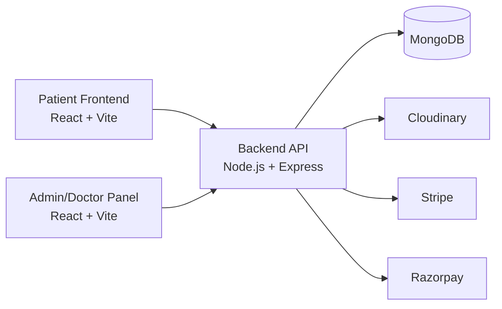
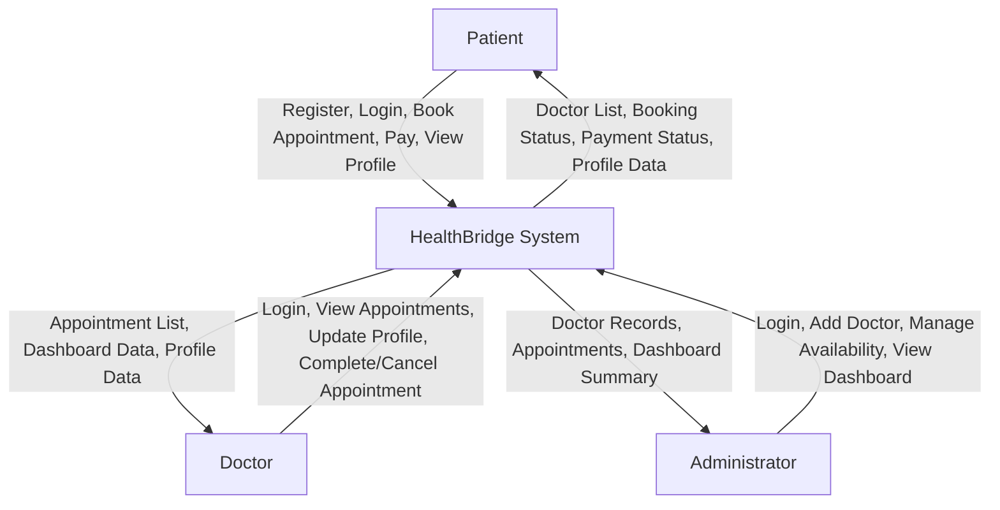
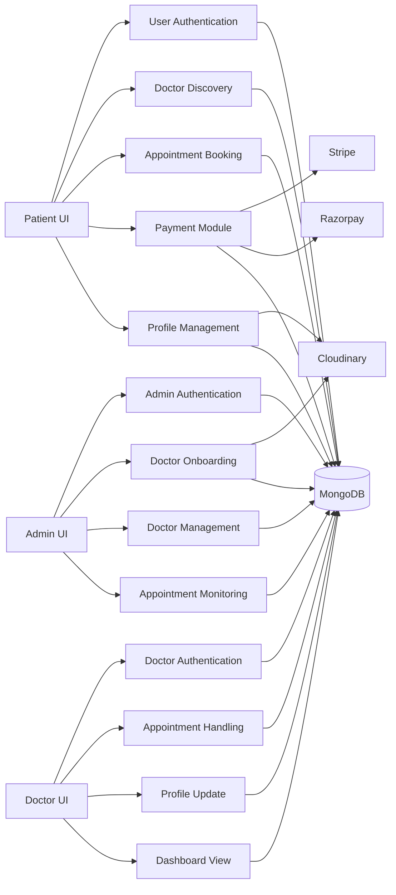
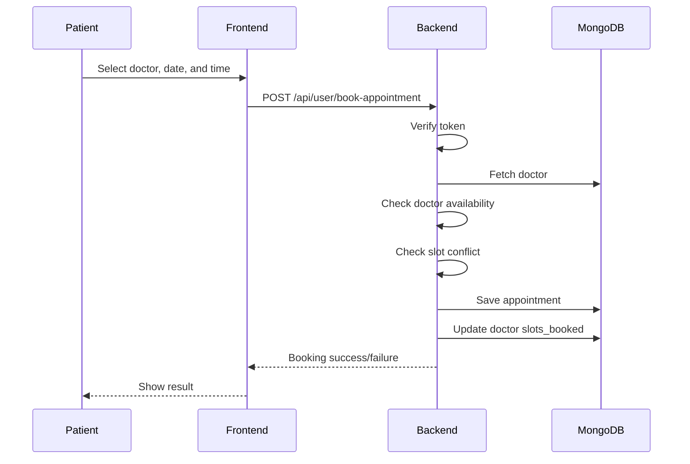
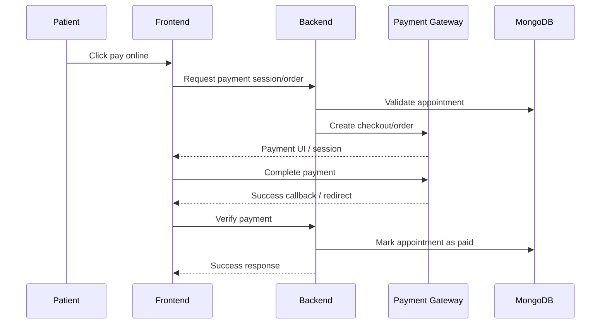

# HealthBridge

HealthBridge is a full-stack MERN-based healthcare appointment management platform designed to connect patients, doctors, and administrators through a single digital workflow. The project is divided into three applications:

- `frontend` for patients
- `admin` for administrators and doctors
- `backend` for API, authentication, database access, file upload, and payment processing

The system supports patient registration and login, doctor discovery, appointment booking, appointment cancellation, online payment, doctor profile management, doctor-side appointment handling, and admin-side doctor onboarding and operational monitoring.

This README is written as a detailed project report and covers the requested sections:

1. Introduction
2. System Architecture
3. Algorithm
4. System Requirement
5. Data Flow Diagram
6. Coding
7. Result and Discussion
8. Advantages and Disadvantages
9. Conclusion
10. References

---

## Table of Contents

- [1. Introduction](#1-introduction)
- [1.1 Objectives](#11-objectives)
- [1.2 Problem Statement](#12-problem-statement)
- [1.3 Project Scope](#13-project-scope)
- [2. System Architecture](#2-system-architecture)
- [3. Algorithm](#3-algorithm)
- [4. System Requirement](#4-system-requirement)
- [4.1 Hardware Requirements](#41-hardware-requirements)
- [4.2 Software Requirements](#42-software-requirements)
- [5. Data Flow Diagram](#5-data-flow-diagram)
- [6. Coding](#6-coding)
- [7. Result and Discussion](#7-result-and-discussion)
- [8. Advantages and Disadvantages](#8-advantages-and-disadvantages)
- [9. Conclusion](#9-conclusion)
- [10. References](#10-references)

---

## 1. Introduction

HealthBridge was developed to simplify the process of scheduling and managing medical appointments. Traditional appointment systems often rely on manual phone calls, paper records, in-person registration, or fragmented software tools. These approaches create inefficiencies for patients, doctors, and healthcare administrators.

This project addresses that gap by providing a web-based healthcare management system that centralizes the appointment lifecycle. Patients can register, browse doctors by specialization, select available time slots, book appointments, manage their profile, and pay online. Doctors can log in to a dedicated dashboard, view upcoming appointments, mark consultations as completed, and update their professional profile. Administrators can add doctors, monitor the platform, manage appointments, and view operational summaries.

HealthBridge uses modern full-stack web technologies:

- React and Vite for responsive client applications
- Tailwind CSS for UI styling
- Node.js and Express for REST APIs
- MongoDB with Mongoose for data persistence
- JWT-based authentication for secured access
- Cloudinary for doctor and patient image uploads
- Stripe and Razorpay for online payment handling
- Vercel for deployment

The project demonstrates how a modular MERN application can be used to digitize healthcare interactions while maintaining usability for multiple roles.

### 1.1 Objectives

The major objectives of the HealthBridge project are:

1. To provide a digital platform for booking doctor appointments from any location.
2. To reduce manual dependency in appointment scheduling and doctor management.
3. To allow patients to view doctor details such as specialization, experience, fees, and availability before booking.
4. To support secure patient registration and login using token-based authentication.
5. To allow doctors to view, manage, complete, and cancel appointments from their own dashboard.
6. To provide an admin interface for doctor onboarding, doctor availability management, and overall appointment supervision.
7. To enable online payment for appointment fees using Razorpay and Stripe.
8. To maintain persistent healthcare scheduling data using MongoDB.
9. To demonstrate a full-stack, role-based web architecture suitable for academic submission and practical deployment.
10. To create a scalable foundation for future healthcare features such as prescriptions, notifications, medical history, and teleconsultation.

### 1.2 Problem Statement

In many small clinics, hospitals, and independent practices, appointment booking and doctor scheduling are still handled manually or through disconnected systems. This creates several problems:

- Patients may not know which doctors are available or what time slots remain open.
- Manual booking is slow and can lead to double-booking or missed entries.
- Doctors do not always have a centralized panel to manage their appointments efficiently.
- Administrators need to maintain doctor records, patient bookings, and availability without a unified workflow.
- Payment tracking may happen outside the appointment process, which makes reconciliation difficult.
- A lack of centralized digital records reduces convenience, transparency, and operational efficiency.

The problem, therefore, is to design and implement a secure, role-based, web-based system that can:

- manage users, doctors, and appointments in one platform
- avoid slot conflicts
- allow secure profile and schedule management
- support appointment payment and verification
- improve transparency for all stakeholders

### 1.3 Project Scope

The scope of HealthBridge includes the following functional areas.

#### In Scope

- Patient registration and login
- Patient profile creation and update
- Doctor listing and filtering by specialty
- Appointment slot generation on the patient side
- Appointment booking with slot conflict prevention
- Appointment listing and cancellation
- Online payment initiation and verification
- Admin login and dashboard
- Doctor login and dashboard
- Doctor profile update
- Admin ability to add new doctors with image upload
- Admin and doctor availability control
- Dashboard summaries for appointments, patients, doctors, and earnings

#### Out of Scope in Current Version

- Real-time chat between doctor and patient
- Electronic prescription management
- Medical record storage
- Email/SMS notifications
- Insurance claim processing
- Video consultation
- Advanced analytics and reporting export
- Multi-hospital tenancy and branch management
- Automated testing suite
- Role-based audit logs

#### Target Users

- Patients seeking appointments with doctors
- Doctors managing their professional schedule
- Administrators maintaining the platform and doctor registry

---

## 2. System Architecture

HealthBridge follows a three-tier modular architecture:

1. Presentation Layer
2. Application Layer
3. Data and External Services Layer

### 2.1 High-Level Architecture



### 2.2 Layer Description

#### Presentation Layer

This layer contains the two React applications:

- `frontend/` for patients
- `admin/` for administrators and doctors

Responsibilities:

- render user interfaces
- collect input through forms
- call backend APIs through Axios
- manage local state and tokens
- display toast notifications for feedback
- route users across pages through React Router

#### Application Layer

This layer is implemented in `backend/` using Express.js.

Responsibilities:

- define REST API endpoints
- validate incoming requests
- authenticate users, doctors, and admin sessions
- process business logic for appointments and payments
- read and write MongoDB documents using Mongoose
- upload files to Cloudinary
- communicate with Razorpay and Stripe

#### Data and External Services Layer

This layer includes:

- MongoDB for persistent storage
- Cloudinary for image hosting
- Razorpay for payment order creation and verification
- Stripe Checkout for payment session generation and verification

### 2.3 Module-Wise Architecture

#### Patient Application (`frontend`)

Main responsibilities:

- user sign up and login
- doctor browsing
- viewing doctor details
- selecting appointment slots
- booking appointments
- managing personal profile
- viewing appointment history
- paying for appointments

Important files:

- `frontend/src/App.jsx`
- `frontend/src/context/AppContext.jsx`
- `frontend/src/pages/Appointment.jsx`
- `frontend/src/pages/MyAppointments.jsx`
- `frontend/src/pages/MyProfile.jsx`
- `frontend/src/pages/Verify.jsx`

#### Admin and Doctor Application (`admin`)

This application serves two different roles inside the same interface:

- admin
- doctor

Admin features:

- login using admin credentials
- add doctors
- view all appointments
- monitor counts through dashboard
- change doctor availability

Doctor features:

- login using doctor account
- view dashboard summary
- view own appointments
- cancel or complete appointments
- edit doctor profile

Important files:

- `admin/src/App.jsx`
- `admin/src/context/AdminContext.jsx`
- `admin/src/context/DoctorContext.jsx`
- `admin/src/pages/Admin/AddDoctor.jsx`
- `admin/src/pages/Admin/Dashboard.jsx`
- `admin/src/pages/Doctor/DoctorAppointments.jsx`
- `admin/src/pages/Doctor/DoctorProfile.jsx`

#### Backend API (`backend`)

Main responsibilities:

- user, doctor, and admin authentication
- profile management
- appointment storage and status management
- slot occupancy tracking
- dashboard data aggregation
- payment order and payment verification
- file upload handling

Important files:

- `backend/server.js`
- `backend/routes/*.js`
- `backend/controllers/*.js`
- `backend/models/*.js`
- `backend/middleware/*.js`
- `backend/config/mongodb.js`
- `backend/config/cloudinary.js`

### 2.4 Authentication Architecture

HealthBridge uses JSON Web Tokens for role-based protection.

- Patient token is sent in the `token` header.
- Doctor token is sent in the `dtoken` header.
- Admin token is sent in the `atoken` header.

Protection flow:

1. User logs in.
2. Backend verifies credentials.
3. Backend signs a JWT using `JWT_SECRET`.
4. Token is stored in local storage by the client.
5. Protected API requests include the token in request headers.
6. Middleware verifies the token and injects the role identity into `req.body`.

Middleware used:

- `authUser.js`
- `authDoctor.js`
- `authAdmin.js`

### 2.5 Database Architecture

The backend uses three main collections:

- `users`
- `doctors`
- `appointments`

#### User Model

Stores:

- patient name
- email
- hashed password
- image
- phone
- address
- gender
- date of birth

#### Doctor Model

Stores:

- doctor name
- email
- hashed password
- profile image
- specialty
- degree
- years of experience
- about section
- consultation fee
- address
- availability
- booked slots object
- created date

#### Appointment Model

Stores:

- patient identifier
- doctor identifier
- slot date
- slot time
- patient snapshot data
- doctor snapshot data
- consultation fee
- created date
- payment status
- cancellation status
- completion status

### 2.6 Request Processing Flow

Typical request lifecycle:

1. Client triggers an action from UI.
2. Axios sends request to backend base URL.
3. Express route maps the request to a controller.
4. Middleware verifies role-based authorization if needed.
5. Controller validates data and executes business logic.
6. Mongoose updates or reads database documents.
7. External services are invoked if upload or payment is involved.
8. JSON response is returned to the client.
9. React updates the interface and shows a toast notification.

### 2.7 Deployment Architecture

The project is designed for separate deployment of its three applications:

- backend deployed as an Express/Vercel service
- frontend deployed as a Vite/Vercel application
- admin deployed as a separate Vite/Vercel application

This separation improves modular deployment, allows environment variables to be configured independently, and makes it easier to maintain different interfaces for different user roles.

---

## 3. Algorithm

This section explains the major algorithms and workflows implemented in HealthBridge.

### 3.1 User Registration Algorithm

**Input:** `name`, `email`, `password`

**Steps:**

1. Receive registration request from frontend.
2. Check whether all required fields are present.
3. Validate email format using `validator`.
4. Check password length.
5. Generate salt using `bcrypt.genSalt(10)`.
6. Hash the password using `bcrypt.hash`.
7. Create a new user document in MongoDB.
8. Generate JWT token with user ID.
9. Return success response with token.

**Output:** user account created and authenticated session started

### 3.2 User Login Algorithm

**Input:** `email`, `password`

**Steps:**

1. Receive login request.
2. Search user by email.
3. If user does not exist, return failure.
4. Compare entered password with hashed password using `bcrypt.compare`.
5. If valid, generate JWT token.
6. Return token to frontend.

**Output:** authenticated patient session

### 3.3 Doctor Login Algorithm

**Input:** `email`, `password`

**Steps:**

1. Receive doctor login request.
2. Find doctor record by email.
3. Verify hashed password with bcrypt.
4. Generate doctor JWT token on success.
5. Return token for doctor dashboard access.

### 3.4 Admin Login Algorithm

**Input:** `email`, `password`

**Steps:**

1. Receive admin login request.
2. Compare provided credentials with environment variables `ADMIN_EMAIL` and `ADMIN_PASSWORD`.
3. If matched, sign token using the admin credential string.
4. Return admin token.
5. Middleware later verifies the decoded token against the same admin credential combination.

### 3.5 Doctor Addition Algorithm

**Input:** doctor form data and image

**Steps:**

1. Admin submits doctor details and image.
2. Backend validates all required doctor fields.
3. Validate email format.
4. Validate password length.
5. Hash doctor password.
6. Upload doctor image to Cloudinary.
7. Convert address JSON string into object.
8. Create new doctor document with fee, specialization, about text, and availability.
9. Save document in MongoDB.
10. Return success message.

**Output:** doctor added to the system and becomes visible in doctor listing

### 3.6 Appointment Slot Generation Algorithm

This logic is implemented on the patient side in `frontend/src/pages/Appointment.jsx`.

**Goal:** generate available slots for the next 7 days in 30-minute intervals while excluding already booked times.

**Steps:**

1. Read doctor profile and existing `slots_booked`.
2. Start from current date.
3. Repeat for the next 7 days.
4. For each day, define a time window from approximately `10:00 AM` to `9:00 PM`.
5. If current day is today, start from the next available half-hour block after the current time.
6. Generate slots in 30-minute intervals.
7. Format the date as `day_month_year`.
8. Check whether the slot time exists in the doctor’s `slots_booked[slotDate]`.
9. If not booked, push slot into the UI list.
10. Render daily slot groups on the appointment page.

**Output:** visible list of bookable appointment times

### 3.7 Appointment Booking Algorithm

**Input:** `docId`, `slotDate`, `slotTime`, authenticated patient token

**Steps:**

1. Verify user authentication using `authUser`.
2. Fetch doctor by ID.
3. Check doctor availability flag.
4. Read current `slots_booked` object from doctor record.
5. Check whether the selected `slotDate` already contains the requested `slotTime`.
6. If slot is already present, reject booking.
7. Otherwise, append the slot to `slots_booked`.
8. Fetch user record for snapshot storage.
9. Create appointment object containing:
   - user ID
   - doctor ID
   - patient snapshot
   - doctor snapshot
   - fee amount
   - slot date and time
   - booking date
10. Save appointment to MongoDB.
11. Update doctor’s `slots_booked` in MongoDB.
12. Return success response.

**Output:** appointment booked successfully without slot duplication

### 3.8 Appointment Cancellation Algorithm

The platform supports cancellation from:

- patient panel
- doctor panel
- admin panel

#### Patient Cancellation

1. Authenticate patient.
2. Fetch appointment by ID.
3. Verify that appointment belongs to the requesting user.
4. Set `cancelled = true`.
5. Fetch doctor record.
6. Remove the time slot from doctor’s `slots_booked`.
7. Save updated slot list.
8. Return success response.

#### Doctor Cancellation

1. Authenticate doctor.
2. Fetch appointment by ID.
3. Verify that appointment belongs to the logged-in doctor.
4. Set `cancelled = true`.
5. Return result.

#### Admin Cancellation

1. Authenticate admin.
2. Fetch appointment by ID.
3. Set `cancelled = true`.
4. Return result.

### 3.9 Appointment Completion Algorithm

**Input:** doctor token and appointment ID

**Steps:**

1. Authenticate doctor.
2. Fetch appointment by ID.
3. Verify ownership using doctor ID.
4. Update `isCompleted = true`.
5. Return success message.

**Output:** consultation marked as completed

### 3.10 Razorpay Payment Algorithm

**Steps:**

1. Patient opens appointment payment action.
2. Frontend requests `/api/user/payment-razorpay`.
3. Backend fetches appointment.
4. If appointment is cancelled or missing, return failure.
5. Backend creates Razorpay order using:
   - appointment amount
   - project currency
   - appointment ID as receipt
6. Order object is returned to frontend.
7. Frontend initializes Razorpay checkout with returned order.
8. On successful payment, Razorpay returns response identifiers.
9. Frontend sends them to `/api/user/verifyRazorpay`.
10. Backend fetches order status from Razorpay.
11. If order is marked `paid`, backend updates appointment `payment = true`.
12. Success response is returned to frontend.

### 3.11 Stripe Payment Algorithm

**Steps:**

1. Patient clicks Stripe payment option.
2. Frontend calls `/api/user/payment-stripe`.
3. Backend fetches appointment.
4. If appointment is cancelled or invalid, reject.
5. Backend creates Stripe Checkout session.
6. Success and cancel URLs point to frontend `/verify` page with query parameters.
7. Backend returns `session_url`.
8. Frontend redirects browser to Stripe Checkout.
9. After payment, Stripe redirects back to frontend verification route.
10. Frontend calls `/api/user/verifyStripe` with `appointmentId` and `success`.
11. Backend marks appointment `payment = true` if success is `true`.

### 3.12 Dashboard Aggregation Algorithm

#### Admin Dashboard

1. Fetch all doctors.
2. Fetch all users.
3. Fetch all appointments.
4. Count total doctors, patients, and appointments.
5. Reverse appointment order to show latest bookings first.
6. Return dashboard summary.

#### Doctor Dashboard

1. Fetch all appointments belonging to the doctor.
2. Calculate earnings from appointments that are paid or completed.
3. Build a unique patient list by checking unique `userId` values.
4. Count appointments and unique patients.
5. Reverse appointments to show latest first.
6. Return summary object.

### 3.13 Simplified Pseudocode

```text
BEGIN
  IF user wants to register THEN
    validate input
    hash password
    save user
    generate token
  ENDIF

  IF patient wants to book appointment THEN
    authenticate patient
    fetch doctor
    check doctor availability
    check slot conflict
    create appointment
    update doctor slots
  ENDIF

  IF payment requested THEN
    create gateway session/order
    redirect/open payment UI
    verify payment result
    mark appointment as paid
  ENDIF

  IF doctor/admin manages appointments THEN
    authenticate role
    update appointment status
    refresh dashboard data
  ENDIF
END
```

---

## 4. System Requirement

The following requirements describe the recommended environment for development and execution of the HealthBridge platform.

### 4.1 Hardware Requirements

#### Minimum Hardware

- Processor: Intel Core i3 or equivalent
- RAM: 4 GB
- Storage: 1 GB free space for source code, dependencies, and cache
- Internet: required for MongoDB Atlas, Cloudinary, Stripe, Razorpay, and deployment services

#### Recommended Hardware

- Processor: Intel Core i5 / Ryzen 5 or higher
- RAM: 8 GB or more
- Storage: SSD with at least 2 GB free working space
- Display: 1366 x 768 or above

#### Server/Hosting Side

- Any environment capable of running Node.js and serving static Vite builds
- Cloud-hosted MongoDB instance
- Secure environment variable support
- Stable internet connectivity

### 4.2 Software Requirements

#### Operating System

- Windows 10/11
- Linux
- macOS

#### Development Tools

- Node.js 18+ recommended
- npm 9+ recommended
- Visual Studio Code or any modern IDE
- Git for version control
- Web browser such as Chrome, Edge, or Firefox

#### Frontend Stack

- React 18
- Vite 5
- React Router DOM 6
- Axios
- Tailwind CSS
- React Toastify

#### Backend Stack

- Node.js
- Express.js
- Mongoose
- JSON Web Token
- bcrypt
- multer
- validator
- cors
- dotenv

#### Database and External Services

- MongoDB / MongoDB Atlas
- Cloudinary
- Razorpay
- Stripe
- Vercel

### 4.3 Package Dependencies Used in the Project

#### Backend Dependencies

- `bcrypt`
- `cloudinary`
- `cors`
- `dotenv`
- `express`
- `jsonwebtoken`
- `mongoose`
- `multer`
- `nodemon`
- `razorpay`
- `stripe`
- `validator`

#### Frontend Dependencies

- `axios`
- `react`
- `react-dom`
- `react-router-dom`
- `react-toastify`
- `tailwindcss`
- `vite`

#### Admin Dependencies

- `axios`
- `react`
- `react-dom`
- `react-router-dom`
- `react-toastify`
- `tailwindcss`
- `vite`

### 4.4 Environment Configuration

Create separate `.env` files for `backend`, `frontend`, and `admin`.

#### `backend/.env`

```env
PORT=4000
MONGODB_URI=your_mongodb_connection_string
JWT_SECRET=your_jwt_secret

ADMIN_EMAIL=admin@example.com
ADMIN_PASSWORD=your_admin_password

CLOUDINARY_NAME=your_cloudinary_name
CLOUDINARY_API_KEY=your_cloudinary_api_key
CLOUDINARY_SECRET_KEY=your_cloudinary_secret_key

RAZORPAY_KEY_ID=your_razorpay_key_id
RAZORPAY_KEY_SECRET=your_razorpay_key_secret
STRIPE_SECRET_KEY=your_stripe_secret_key

CURRENCY=INR
```

#### `frontend/.env`

```env
VITE_BACKEND_URL=http://localhost:4000
VITE_RAZORPAY_KEY_ID=your_razorpay_key_id
```

#### `admin/.env`

```env
VITE_BACKEND_URL=http://localhost:4000
VITE_CURRENCY=INR
```

### 4.5 Installation and Execution

#### Step 1: Install Dependencies

```bash
cd backend
npm install

cd ../frontend
npm install

cd ../admin
npm install
```

#### Step 2: Start the Backend

```bash
cd backend
npm run server
```

#### Step 3: Start the Patient Frontend

```bash
cd frontend
npm run dev
```

#### Step 4: Start the Admin/Doctor Panel

```bash
cd admin
npm run dev
```

#### Step 5: Access the Applications

- Patient frontend: typically `http://localhost:5173`
- Admin/doctor panel: typically `http://localhost:5174`
- Backend API: `http://localhost:4000`

---

## 5. Data Flow Diagram

Data Flow Diagrams below explain how data moves across the platform.

### 5.1 Level 0 DFD (Context Diagram)



### 5.2 Level 1 DFD



### 5.3 Appointment Booking Data Flow



### 5.4 Payment Flow Data Diagram



---

## 6. Coding

This section describes the project structure, code organization, route mapping, schema design, and key implementation details.

### 6.1 Project Structure

```text
HealthBridge/
├── admin/
│   ├── src/
│   │   ├── components/
│   │   ├── context/
│   │   ├── pages/
│   │   │   ├── Admin/
│   │   │   └── Doctor/
│   │   └── assets/
│   ├── package.json
│   └── vite.config.js
├── backend/
│   ├── config/
│   ├── controllers/
│   ├── middleware/
│   ├── models/
│   ├── routes/
│   ├── package.json
│   └── server.js
├── frontend/
│   ├── src/
│   │   ├── components/
│   │   ├── context/
│   │   ├── pages/
│   │   └── assets/
│   ├── package.json
│   └── vite.config.js
└── README.md
```

### 6.2 Frontend Coding Details

The patient-facing frontend is built with React components and `AppContext` for shared application state.

#### Main Routes

| Route | Page | Purpose |
|---|---|---|
| `/` | `Home` | Landing page |
| `/doctors` | `Doctors` | Doctor listing |
| `/doctors/:speciality` | `Doctors` | Specialty-based filtering |
| `/login` | `Login` | Patient authentication |
| `/about` | `About` | About page |
| `/contact` | `Contact` | Contact page |
| `/appointment/:docId` | `Appointment` | Doctor details and slot booking |
| `/my-appointments` | `MyAppointments` | Appointment history and payment |
| `/my-profile` | `MyProfile` | Profile view and update |
| `/verify` | `Verify` | Stripe verification callback |

#### State Management

`frontend/src/context/AppContext.jsx` manages:

- doctor list
- patient auth token
- patient profile data
- backend base URL
- currency symbol

#### Major Patient-Side Functionalities

1. Fetch doctors from `/api/doctor/list`
2. Store patient token in local storage
3. Load patient profile after login
4. Generate appointment slots dynamically
5. Book appointment using authenticated request
6. View and cancel booked appointments
7. Initiate Razorpay or Stripe payment
8. Update profile including image upload

### 6.3 Admin and Doctor Panel Coding Details

The `admin` application uses separate contexts for admin and doctor while sharing the same UI shell.

#### Role Handling

- `AdminContext` handles admin token, doctor list, appointment list, and dashboard data.
- `DoctorContext` handles doctor token, doctor appointments, doctor dashboard data, and profile data.
- `AppContext` in admin provides shared formatting helpers such as age and slot date formatting.

#### Main Admin Routes

| Route | Purpose |
|---|---|
| `/admin-dashboard` | admin overview |
| `/all-appointments` | view all appointments |
| `/add-doctor` | create new doctor |
| `/doctor-list` | doctor listing and availability toggle |

#### Main Doctor Routes

| Route | Purpose |
|---|---|
| `/doctor-dashboard` | doctor overview |
| `/doctor-appointments` | doctor appointment management |
| `/doctor-profile` | doctor profile edit |

### 6.4 Backend Coding Details

The backend follows a common Express architecture:

- `routes/` to define endpoints
- `controllers/` to hold request logic
- `models/` to define MongoDB schemas
- `middleware/` to enforce authentication and file handling
- `config/` to initialize integrations

### 6.5 API Endpoints

#### User Routes: `/api/user`

| Method | Endpoint | Purpose | Auth |
|---|---|---|---|
| `POST` | `/register` | register patient | No |
| `POST` | `/login` | patient login | No |
| `GET` | `/get-profile` | fetch patient profile | Yes |
| `POST` | `/update-profile` | update patient profile | Yes |
| `POST` | `/book-appointment` | book appointment | Yes |
| `GET` | `/appointments` | list patient appointments | Yes |
| `POST` | `/cancel-appointment` | cancel appointment | Yes |
| `POST` | `/payment-razorpay` | create Razorpay order | Yes |
| `POST` | `/verifyRazorpay` | verify Razorpay payment | Yes |
| `POST` | `/payment-stripe` | create Stripe checkout session | Yes |
| `POST` | `/verifyStripe` | verify Stripe payment | Yes |

#### Doctor Routes: `/api/doctor`

| Method | Endpoint | Purpose | Auth |
|---|---|---|---|
| `POST` | `/login` | doctor login | No |
| `GET` | `/list` | public doctor listing | No |
| `POST` | `/cancel-appointment` | doctor cancels appointment | Yes |
| `GET` | `/appointments` | doctor appointment list | Yes |
| `POST` | `/change-availability` | toggle availability | Yes |
| `POST` | `/complete-appointment` | mark appointment completed | Yes |
| `GET` | `/dashboard` | doctor dashboard stats | Yes |
| `GET` | `/profile` | doctor profile data | Yes |
| `POST` | `/update-profile` | doctor profile update | Yes |

#### Admin Routes: `/api/admin`

| Method | Endpoint | Purpose | Auth |
|---|---|---|---|
| `POST` | `/login` | admin login | No |
| `POST` | `/add-doctor` | create doctor | Yes |
| `GET` | `/appointments` | view all appointments | Yes |
| `POST` | `/cancel-appointment` | cancel any appointment | Yes |
| `GET` | `/all-doctors` | list all doctors | Yes |
| `POST` | `/change-availability` | toggle doctor availability | Yes |
| `GET` | `/dashboard` | admin dashboard stats | Yes |

### 6.6 Database Schema Summary

#### User Schema

| Field | Type | Notes |
|---|---|---|
| `name` | `String` | required |
| `email` | `String` | required, unique |
| `image` | `String` | default profile image |
| `phone` | `String` | default provided |
| `address` | `Object` | line1, line2 |
| `gender` | `String` | default `Not Selected` |
| `dob` | `String` | default `Not Selected` |
| `password` | `String` | hashed |

#### Doctor Schema

| Field | Type | Notes |
|---|---|---|
| `name` | `String` | required |
| `email` | `String` | required, unique |
| `password` | `String` | hashed |
| `image` | `String` | Cloudinary URL |
| `speciality` | `String` | required |
| `degree` | `String` | required |
| `experience` | `String` | required |
| `about` | `String` | required |
| `available` | `Boolean` | default `true` |
| `fees` | `Number` | required |
| `slots_booked` | `Object` | slot occupancy map |
| `address` | `Object` | line1, line2 |
| `date` | `Number` | creation timestamp |

#### Appointment Schema

| Field | Type | Notes |
|---|---|---|
| `userId` | `String` | patient reference |
| `docId` | `String` | doctor reference |
| `slotDate` | `String` | formatted as `day_month_year` |
| `slotTime` | `String` | human-readable time |
| `userData` | `Object` | patient snapshot |
| `docData` | `Object` | doctor snapshot |
| `amount` | `Number` | consultation fee |
| `date` | `Number` | booking timestamp |
| `cancelled` | `Boolean` | appointment canceled status |
| `payment` | `Boolean` | online payment status |
| `isCompleted` | `Boolean` | consultation completed status |

### 6.7 Middleware Usage

#### `authUser.js`

- verifies patient JWT
- injects `userId` into `req.body`

#### `authDoctor.js`

- verifies doctor JWT
- injects `docId` into `req.body`

#### `authAdmin.js`

- verifies admin JWT
- checks decoded token against admin credentials

#### `multer.js`

- accepts uploaded files
- stores them temporarily on disk before Cloudinary upload

### 6.8 External Service Integration

#### MongoDB

- stores all persistent application data
- accessed through Mongoose schemas and queries

#### Cloudinary

- stores doctor and patient images
- backend uploads images and saves returned secure URL

#### Razorpay

- used for direct payment order generation
- payment is verified by fetching order status

#### Stripe

- used through Stripe Checkout session
- frontend receives redirect URL from backend
- payment status is reflected back through verification route

### 6.9 CORS and Deployment Handling

The backend in `server.js` allows requests from:

- deployed frontend Vercel URL
- local development URL for frontend
- local development URL for admin panel

The backend also exports `app` and conditionally starts `listen()` only in non-serverless environments so the same code can support both local development and Vercel deployment.

### 6.10 Sample Request/Response Understanding

#### Example: Book Appointment Request

```json
{
  "docId": "doctor_id_here",
  "slotDate": "24_4_2026",
  "slotTime": "10:30 AM"
}
```

#### Example: Successful Booking Response

```json
{
  "success": true,
  "message": "Appointment Booked"
}
```

### 6.11 Security Measures Implemented

- password hashing with bcrypt
- token-based authorization with JWT
- route protection using middleware
- environment variable based secret storage
- separation of roles across headers and dashboards

### 6.12 Current Technical Limitations Observed in Code

This subsection is useful for report discussion because it shows implementation awareness.

- The project currently has no automated test suite.
- Appointment slot generation is done on the frontend, so the backend relies on the submitted slot plus stored slot map rather than a centralized scheduling engine.
- Stripe verification is based on redirected success status rather than webhook validation.
- Admin credentials are stored in environment variables rather than a dedicated admin collection.
- Appointment records store embedded snapshots of user and doctor data, which is practical for display consistency but duplicates some information.

---

## 7. Result and Discussion

### 7.1 Result

The HealthBridge project successfully implements a working multi-role healthcare appointment system with the following outcomes:

#### Patient-Side Results

- patients can create accounts and log in
- patients can browse doctors and specialty-based listings
- patients can view doctor qualifications, fees, and experience
- patients can book available appointment slots
- patients can view appointment history
- patients can cancel booked appointments
- patients can pay online using Razorpay or Stripe
- patients can update personal profile information and image

#### Doctor-Side Results

- doctors can log in separately from admin
- doctors can view all appointments assigned to them
- doctors can mark consultations as completed
- doctors can cancel appointments
- doctors can update profile fields like availability, fees, address, and about section
- doctors can view dashboard statistics including appointments, patients, and earnings

#### Admin-Side Results

- admin can log in securely
- admin can add doctors with images and credentials
- admin can view doctor list
- admin can toggle doctor availability
- admin can view all appointments in the system
- admin can cancel appointments
- admin can view dashboard counts for doctors, appointments, and patients

### 7.2 Discussion

The project demonstrates a clear full-stack implementation of role-based healthcare workflow management. The separation of patient and admin/doctor clients creates a practical architecture in which each user type gets a specialized interface. The backend acts as the central business logic layer and enforces protected access through middleware.

One of the important design decisions is the use of the `slots_booked` object inside the doctor model. This provides a straightforward way to prevent double-booking. Another useful design choice is storing appointment-time snapshots of both patient and doctor data in the appointment record, which helps preserve historical display information even if profiles change later.

The project also demonstrates useful integration of external services:

- Cloudinary for image hosting
- Razorpay for regional payment support
- Stripe for international checkout flow

From an academic and practical perspective, the project is strong because it includes:

- authentication
- CRUD-like management flows
- dashboard aggregation
- third-party API integration
- file upload handling
- database persistence
- modular frontend and backend organization

### 7.3 Performance and Usability Discussion

- Vite provides fast frontend development and build performance.
- React-based routing gives a smooth single-page application experience.
- MongoDB suits the flexible document structures used for doctors, users, and appointments.
- Tailwind CSS enables rapid UI development and consistent layout styling.

### 7.4 Limitations and Improvement Opportunities

Although the project is operational and complete for core appointment workflow, there are areas where it can be improved:

- payment verification can be hardened with webhooks
- backend-side scheduling rules can be made more robust
- appointment reminders can be added
- search and filtering can be expanded
- automated testing and logging can be added
- role permissions can be made more granular
- analytics can move beyond counts into trends and reports

---

## 8. Advantages and Disadvantages

### 8.1 Advantages

1. Provides a complete digital appointment workflow for multiple user roles.
2. Reduces manual scheduling work and improves convenience.
3. Prevents basic slot conflicts through stored booking state.
4. Supports secure password hashing and token-based authentication.
5. Includes both patient-facing and administrative interfaces.
6. Offers two online payment options.
7. Supports image upload and profile maintenance.
8. Uses scalable and widely adopted web technologies.
9. Has modular code organization that is easy to extend.
10. Can be deployed as independent frontend and backend services.

### 8.2 Disadvantages

1. Lacks automated tests in the current implementation.
2. Uses frontend-generated slot timelines, which can be improved with centralized scheduling logic.
3. Stripe verification is simplified and not webhook-based.
4. Admin authentication relies on environment credentials rather than a full admin user model.
5. No notification system is included.
6. No support yet for prescriptions, medical reports, or telemedicine.
7. Limited specialty list is hardcoded in admin doctor creation form.
8. No advanced reporting, export, or audit trail currently exists.
9. Appointment rescheduling is not implemented.
10. There is no built-in retry or recovery workflow for failed external service interactions.

---

## 9. Conclusion

HealthBridge is a well-structured full-stack healthcare appointment system that addresses the practical problem of manual doctor appointment management. It successfully combines patient booking, doctor scheduling, administrative control, profile handling, file upload, and online payments within a single MERN-based ecosystem.

The project is suitable as:

- an academic major/minor project
- a report/demo-ready full-stack application
- a starting point for a production-grade healthcare scheduling platform

Its main achievement is that it connects three different roles through one coherent data flow while keeping the codebase modular and understandable. With further improvements such as webhooks, notifications, testing, and richer healthcare features, HealthBridge can evolve into a more advanced digital health platform.

---

## 10. References

The following official resources are relevant to the technologies and services used in this project:

1. React Documentation: https://react.dev/
2. Vite Documentation: https://vitejs.dev/
3. Tailwind CSS Documentation: https://tailwindcss.com/docs
4. Node.js Documentation: https://nodejs.org/en/docs
5. Express.js Documentation: https://expressjs.com/
6. MongoDB Documentation: https://www.mongodb.com/docs/
7. Mongoose Documentation: https://mongoosejs.com/docs/
8. JSON Web Token Introduction: https://jwt.io/introduction
9. bcrypt Package: https://www.npmjs.com/package/bcrypt
10. Axios Documentation: https://axios-http.com/docs/intro
11. Cloudinary Node.js SDK Documentation: https://cloudinary.com/documentation/node_integration
12. Razorpay Documentation: https://razorpay.com/docs/
13. Stripe Checkout Documentation: https://docs.stripe.com/payments/checkout
14. Vercel Documentation: https://vercel.com/docs
15. React Router Documentation: https://reactrouter.com/en/main
16. React Toastify Documentation: https://fkhadra.github.io/react-toastify/introduction
17. multer Package: https://www.npmjs.com/package/multer
18. validator Package: https://www.npmjs.com/package/validator

---

## Appendix A: Quick Feature Summary

### Patient Features

- sign up and login
- browse doctors
- filter by specialty
- book appointment
- cancel appointment
- pay online
- update profile

### Doctor Features

- login
- see own appointments
- cancel appointment
- complete appointment
- update profile
- view dashboard

### Admin Features

- login
- add doctor
- view dashboard
- monitor all appointments
- toggle doctor availability

### Core Technical Features

- MERN architecture
- REST API
- JWT authentication
- MongoDB persistence
- Cloudinary image upload
- Stripe and Razorpay integration
- Vercel deployment compatibility

---

## Appendix B: Backend Health Check

Root endpoint:

```http
GET /
```

Expected response:

```text
API Working
```

---

## Appendix C: Suggested Future Enhancements

1. Add email and SMS reminders.
2. Add prescription and consultation notes.
3. Add appointment rescheduling.
4. Add search, filter, and sorting improvements.
5. Add doctor leave calendar and holiday blocking.
6. Add admin analytics export.
7. Add webhook-based payment confirmation.
8. Add unit, integration, and end-to-end testing.
9. Add audit logging and monitoring.
10. Add multi-language support.
